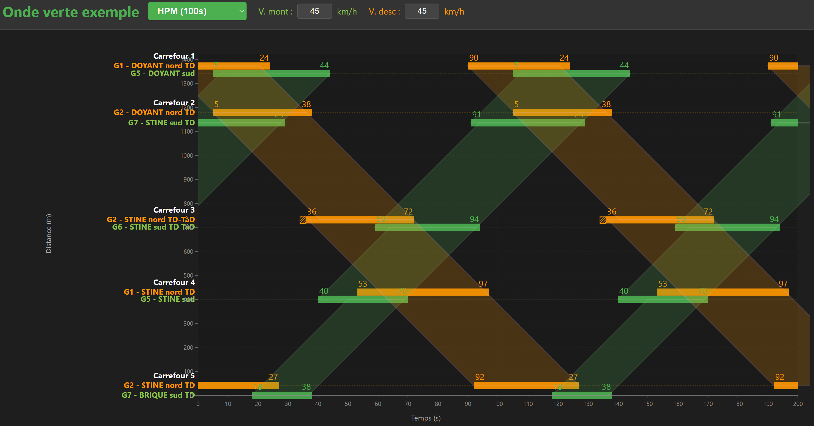

<p align="center">
  
</p>

# TraCflux

Solution open source pour la conception et l'optimisation de plans de feux tricolores, destinée aux traficiens et ingénieurs de la circulation.

### Module Diagramme de Feux


### Module Onde verte



TraCflux s'organise en **deux modules complémentaires** :

- **Diagramme de Feux** *(module principal)* — conception et analyse des plans de feux d'un carrefour : groupes, matrice intervert, diagramme temporel, micro-régulation, plans multiples.
- **Onde verte** *(module complémentaire)* — coordination espace-temps de plusieurs carrefours sur un axe routier, avec visualisation des bandes passantes. S'appuie sur les projets de carrefours préalablement créés dans le module principal.

Conçue pour être utilisée **localement**, sans serveur ni télémétrie : toutes les données restent dans le navigateur (localStorage) et sur votre poste.

## Mode présentation

L'application est conçue pour s'adapter aux contextes de **présentation devant un auditoire** — comités techniques, formations internes, validations devant un client ou échanges pédagogiques avec des élus.

Détachez la fenêtre **Image du carrefour** sur un vidéoprojecteur ou un second écran pour montrer en grand l'animation du carrefour pendant la simulation : les flèches changent de couleur (vert / orange / rouge) seconde par seconde, en suivant le cycle et l'effet des actions de micro-régulation activées.

L'auditoire ne voit que l'essentiel — le carrefour qui « vit » au rythme du cycle — pendant que vous gardez le contrôle complet sur votre écran de travail (diagramme, matrice, panneau de simulation, micro-régulation) et commentez en direct les actions que vous activez et leur effet sur la dynamique du carrefour.

## Fonctionnalités principales

### Module Diagramme de Feux

- Définition des groupes de feux (VL, TC, Cycliste, Piéton) avec durées vert/orange/rouge
- Matrice d'intervert avec détection automatique des conflits
- Diagramme temporel horizontal avec tête de lecture
- Plans de feux multiples (PF) gérés par onglets
- Table d'actions de micro-régulation par plan (escamotage, ouverture/fermeture anticipée, etc.)
- Fond de plan personnalisable (photo aérienne, plan CAO, schéma au trait) avec flèches d'animation des groupes
- Import/export (JSON, CSV, Excel)
- Export PDF et PNG du diagramme

### Module Onde verte

- Coordination de plusieurs carrefours sur un axe routier
- Visualisation espace-temps avec bandes passantes (sens montant et descendant)
- Réglage interactif des décalages, vitesses et plans de feux
- Synchronisation bidirectionnelle avec les projets du module principal

### Transverse

- Thèmes (sombre, clair, haut contraste, ambre, daltonien, sépia, bleu nuit)
- Détachement de fenêtres (matrice, formulaire, données trafic, etc.) sur un second écran
- Rapport de diagnostic pour signalement de bug (local, sans envoi réseau)

## Installation

Prérequis : [Node.js](https://nodejs.org/) 18 ou plus.

```bash
git clone https://github.com/ThierryClm/Diagramme_Feux.git
cd Diagramme_Feux
npm install
npm run dev
```

L'application s'ouvre à `http://localhost:3000`.

## Commandes

| Commande | Effet |
|---|---|
| `npm run dev` | Serveur de développement (rechargement à chaud) |
| `npm run build` | Build de production dans `dist/` |
| `npm run preview` | Aperçu local du build de production |
| `npm test` | Lancer les tests (Vitest) |

### Lanceurs preview Windows (optionnel)

Deux scripts VBScript sont fournis pour ouvrir l'aperçu dans une fenêtre navigateur en **mode application** (sans barre d'adresse ni onglets), maximisée :

- [`Lancer-preview.vbs`](Lancer-preview.vbs) — Microsoft Edge
- [`Lancer-preview-chrome.vbs`](Lancer-preview-chrome.vbs) — Google Chrome

Pour créer un raccourci sur le bureau : clic droit sur le fichier `.vbs` → **Envoyer vers** → **Bureau (créer un raccourci)**. Le double-clic construit l'app si nécessaire, démarre le serveur preview et ouvre la fenêtre. Le lancement est idempotent : un second double-clic réutilise la session existante au lieu d'en démarrer une nouvelle. Une page d'attente s'affiche pendant le build et liste les nouveautés depuis le dernier aperçu.

Ces lanceurs sont spécifiques à Windows. Sur macOS et Linux, utiliser directement `npm run preview` en ligne de commande.

## Exemple

Un projet d'exemple est fourni dans le dossier [`examples/`](examples/). Ouvrez l'application, puis utilisez **Fichier → Ouvrir un projet** et sélectionnez `examples/Carrefour_exemple.json`.

## Architecture

Application React + Vite, état centralisé dans [`src/hooks/useTrafficLight.js`](src/hooks/useTrafficLight.js). Voir [`CLAUDE.md`](CLAUDE.md) pour les détails d'implémentation (structures de données, rendu du timeline, détection de conflits).

## Comptes utilisateurs

L'application embarque un système de comptes optionnel à 3 niveaux de permissions (lecture seule, modification partielle, modification totale) avec mots de passe hachés en SHA-256.

**Important — ce que ce système est, et n'est pas :**

- **Ce que c'est** : une convention de travail pour organiser le partage d'un poste entre plusieurs utilisateurs (par exemple un PC partagé en agence). Empêche les manipulations involontaires (un visiteur en mode lecture ne peut pas accidentellement écraser un projet).
- **Ce que ce n'est pas** : une protection cryptographiquement forte. L'application étant 100 % côté navigateur, sans serveur, n'importe qui ayant accès au poste peut techniquement contourner les comptes (DevTools, modification du code livré, etc.). Le code source étant publié sous licence AGPL v3, le mécanisme est de toute façon visible publiquement.

**Sécurité réelle des fichiers projet** : à assurer au niveau du système d'exploitation et du réseau local — droits NTFS / ACL sur le partage réseau, comptes Windows / Active Directory, permissions de dossier sur le serveur de fichiers. C'est ce niveau qui décide qui peut lire, écrire ou supprimer les `.json` exportés par l'application.

## Sécurité et limites connues

### Import Excel — fichiers d'origine externe

La bibliothèque utilisée pour lire les fichiers Excel (`xlsx` / SheetJS, version `0.18.5`) comporte deux vulnérabilités connues, sans correctif diffusé sur le registre npm officiel :

- **Prototype Pollution** ([GHSA-4r6h-8v6p-xvw6](https://github.com/advisories/GHSA-4r6h-8v6p-xvw6)) — CVSS 7.8
- **ReDoS** (Regular Expression Denial of Service, [GHSA-5pgg-2g8v-p4x9](https://github.com/advisories/GHSA-5pgg-2g8v-p4x9)) — CVSS 7.5

Les versions corrigées existent uniquement sur `cdn.sheetjs.com` (SheetJS a retiré son édition communautaire du registre npm en 2023).

**Recommandation utilisateur :** n'importer que des fichiers `.xlsx` d'**origine connue** (feuilles produites par vous ou par des collègues identifiés). Un fichier malveillant ouvert via l'import pourrait perturber l'onglet du navigateur.

**Évaluation du risque dans l'usage prévu :** faible. TraCflux est un outil **local mono-utilisateur** ; `xlsx` n'est sollicité qu'au moment où l'utilisateur sélectionne manuellement un fichier ([`src/utils/excelImporter.js`](src/utils/excelImporter.js)). Aucun risque pour le système d'exploitation, aucun risque pour les autres projets enregistrés. Seul vecteur résiduel : phishing ciblé.

**Décision actuelle :** statu quo tant que l'usage reste local. Une migration vers `xlsx-js-style`, `exceljs` ou la version corrigée hors-npm de SheetJS sera envisagée si l'app évolue vers un déploiement multi-utilisateurs.

## Questions fréquentes

Une [FAQ](FAQ.md) répond aux questions courantes (confidentialité des données, formats d'import/export, licence, partage de projets, etc.).

## Services & accompagnement

Un service d'accompagnement à la conception de diagrammes de feux est **envisagé pour une étape ultérieure** du projet. L'idée : proposer, pour les carrefours complexes, une aide tirant parti des capacités combinées de gestion par phase et par groupe de feux qu'offre l'outil.

Deux modes de prestation sont pressentis — **assistance technique à la carte** ou **prise en charge complète du projet** à partir des données fournies par l'utilisateur — mais **cette offre n'est pas encore opérationnelle**.

*(Les modalités et coordonnées de contact seront précisées lorsque le service sera disponible.)*

## Contribuer

Les contributions sont les bienvenues. Pour un bug ou une suggestion, ouvrez une [issue GitHub](https://github.com/ThierryClm/Diagramme_Feux/issues). Pour proposer un patch, forkez puis ouvrez une pull request.

Un rapport de diagnostic peut être généré depuis l'app (**À propos → Rapport de diagnostic**) et joint à une issue pour faciliter le débogage.

## Licence

Ce projet est distribué sous licence **GNU Affero General Public License v3.0 ou ultérieure** (AGPL-3.0-or-later). Voir le fichier [`LICENSE`](LICENSE) pour le texte complet.

En résumé :
- Vous pouvez utiliser, modifier et redistribuer le logiciel.
- Si vous distribuez une version modifiée (y compris en la rendant accessible sur un réseau), vous devez publier le code source correspondant sous la même licence.
- Aucune garantie n'est fournie.

© 2026 Thierry Colmon
